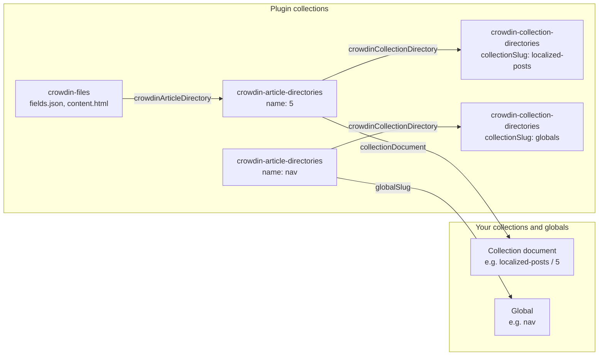
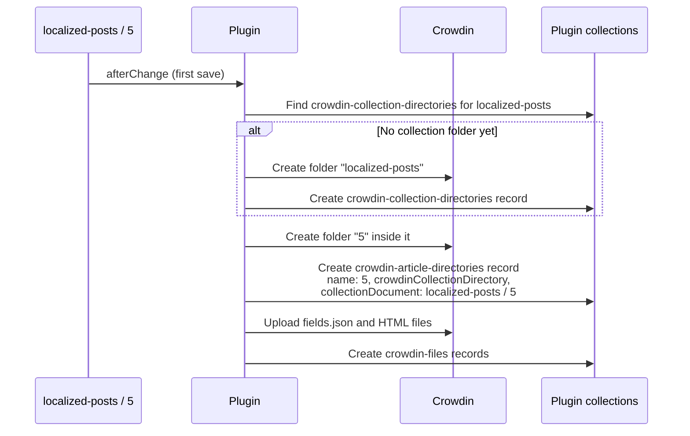
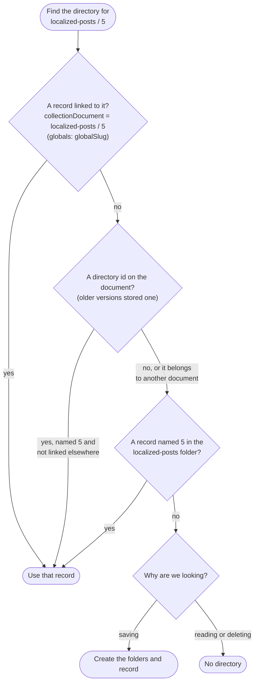
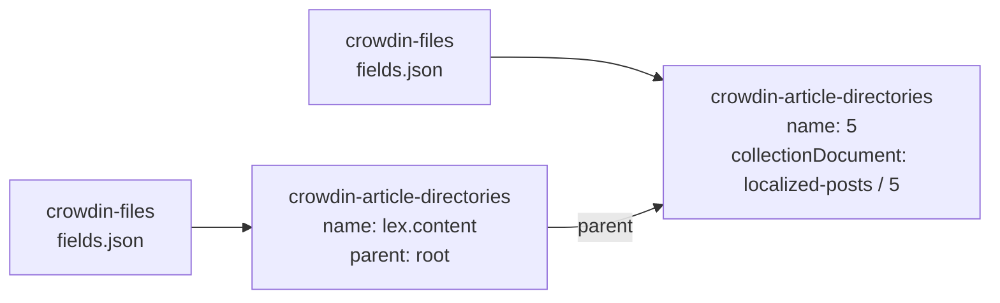
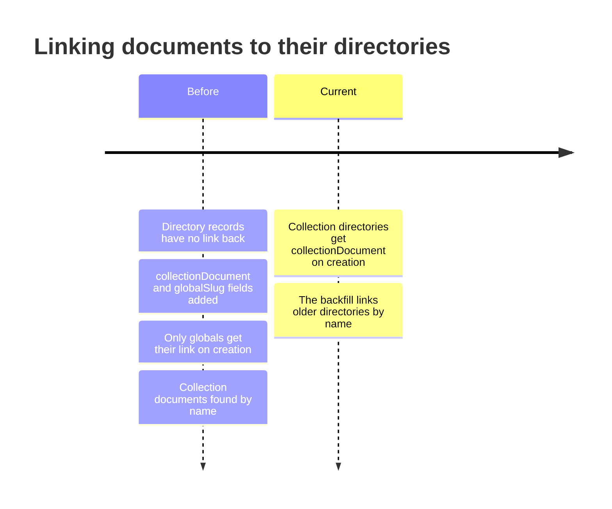
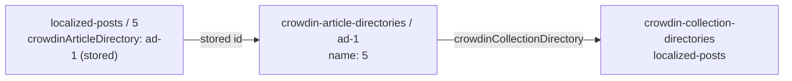
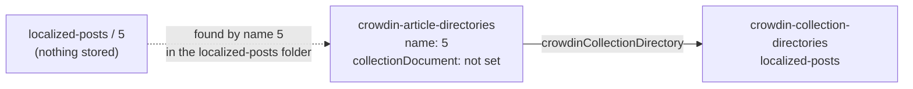
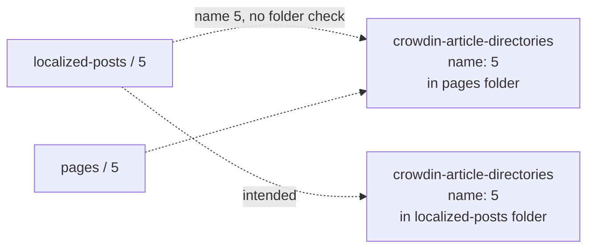
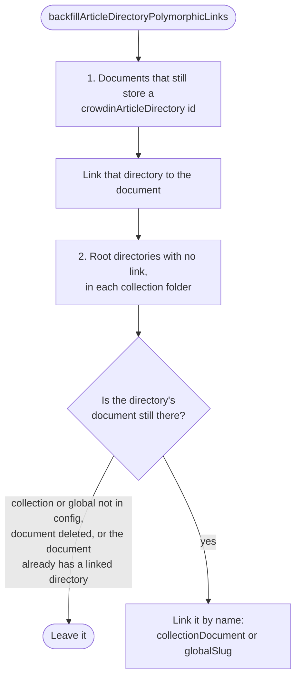

# How documents link to Crowdin directories

The plugin keeps a record of every folder and file it creates on Crowdin, in three collections of its own. This page explains how those records link back to your collection documents and globals, how the plugin finds the right record for a document, and how earlier versions did it.

## The collections

Each record matches something on Crowdin:

| Collection                       | Represents on Crowdin                                                     | Key fields                                                                         |
| -------------------------------- | ------------------------------------------------------------------------- | ---------------------------------------------------------------------------------- |
| `crowdin-collection-directories` | One folder per collection, plus a `globals` folder for all globals        | `collectionSlug`                                                                   |
| `crowdin-article-directories`    | One folder per document or global                                         | `name`, `crowdinCollectionDirectory`, `collectionDocument`, `globalSlug`, `parent` |
| `crowdin-files`                  | One file per document: `fields.json`, or an HTML file per rich text field | `crowdinArticleDirectory`                                                          |

A `crowdin-article-directories` record without a `parent` is a document's **root directory**. Records with a `parent` hold Lexical blocks and sit inside a root directory (see [Lexical blocks](#lexical-blocks)).



## How a root directory links to its document

A root directory records which document it belongs to in two ways:

- **A direct link.**
  - For a collection document: `collectionDocument`, a polymorphic relationship such as `{ relationTo: 'localized-posts', value: '5' }`.
  - For a global: `globalSlug`, such as `nav`.
- **Its name and collection folder.** `name` is the document id (or the global slug), and `crowdinCollectionDirectory` points at its collection's folder (or the `globals` folder).

The direct link is the reliable one. Names repeat across collections: on SQL databases, post `5` and page `5` both have a directory named `5`. So a name only identifies a document together with its collection folder.

Your documents never store anything. Enabled collections and globals get a `crowdinArticleDirectory` relationship field, but it is virtual: the plugin removes it before saving and looks the directory up whenever the document is read.

### Creating the directory

The first time a document is saved with localized content, the plugin creates its folders on Crowdin and records them:



Globals work the same way, inside the `globals` folder, with `globalSlug` instead of `collectionDocument`.

### Finding a document's directory

Syncing, reading and deleting a document all use the same lookup. By default it only uses the direct link. If [`legacyArticleDirectoryLookup`](./README.md#legacyarticledirectorylookup) is on, it also tries the two older paths:



When saving, each record found is first checked on Crowdin. If its folder was deleted on Crowdin, the record is deleted and the next one is tried. See [`disableSelfClean`](./README.md#disableselfclean).

The second and third steps are off unless `legacyArticleDirectoryLookup` is set. Running the [backfill](#linking-older-directories) adds the link, after which the first step finds them. If you save a document whose directory is still unlinked while the option is off, the plugin throws and names the backfill rather than creating a second Crowdin folder.

### Lexical blocks

Blocks inside a Lexical rich text field get their own folder inside the document's folder. Its record has a `parent` (the document's root directory) and a `name` made from the field name, prefixed with `lexicalBlockFolderPrefix`. These records have no `collectionDocument` or `globalSlug`: they are found through their parent.



## How earlier versions linked documents

The way documents are linked has changed twice. Directories created by each version are still in your database until the backfill links them.



### Before #270: the id stored on the document

After creating a document's directory, the plugin wrote the directory's id into the document's `crowdinArticleDirectory` field. That stored value was the only link: the directory record didn't point back at the document.



This had two problems:

- **Writing to your documents.** Saving the id back to the document could fail on validation errors after the files were already on Crowdin ([#267](https://github.com/thompsonsj/payload-crowdin-sync/issues/267)).
- **Duplicates shared a directory.** Until [#294](https://github.com/thompsonsj/payload-crowdin-sync/pull/294), duplicating a document copied the stored id, so the copy pointed at the original's directory. The plugin now only uses a stored id if the record is named for that document and isn't linked to another one.

### From #270: links on the directory, found by name

[#270](https://github.com/thompsonsj/payload-crowdin-sync/pull/270) made `crowdinArticleDirectory` virtual and moved the link onto the directory record, with `collectionDocument` and `globalSlug`. New global directories got `globalSlug`, but new collection directories were created without `collectionDocument`. So collection documents were found by `name`:



Until [#372](https://github.com/thompsonsj/payload-crowdin-sync/pull/372), some lookups matched `name` without checking the collection folder. On SQL databases, deleting post `5` could delete page `5`'s directory:



### Linking older directories

Directories from either earlier version can be linked with the backfill. Call it once, for example from `onInit` or a one-off script. It is safe to run again.

```ts
import { backfillArticleDirectoryPolymorphicLinks } from 'payload-crowdin-sync';

const result = await backfillArticleDirectoryPolymorphicLinks(payload);
// { collectionDocumentsUpdated: number, globalsUpdated: number }
```



Once every directory is linked, leave `legacyArticleDirectoryLookup` off. A future major version will remove that option, then remove the `crowdinArticleDirectory` field from your documents. See [planned features](../repo/planned-features.md#remove-the-crowdinarticledirectory-field-from-synced-documents).
